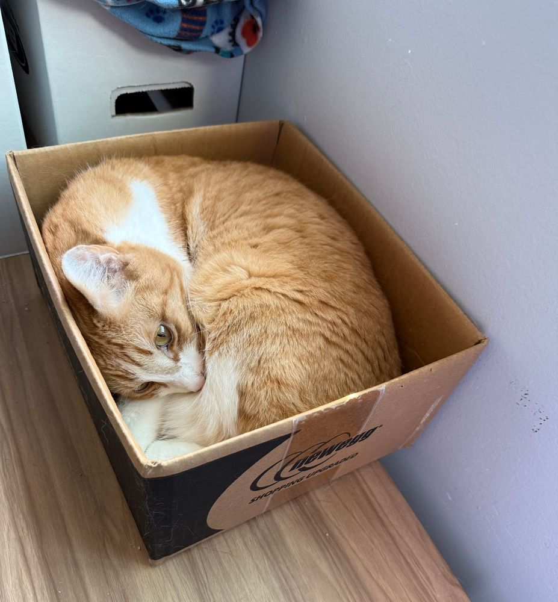

# LLM Intro {visibility="hidden"}

## :bulb: Overview

::: {style="font-size: 0.70em" }

In this workshop, you’ll learn how to run Large Language Models (LLMs) on the Hoffman2 HPC cluster using **Ollama** for inference and **Open WebUI** and **Jupyter** for a user-friendly interface. We’ll walk through setup, performance tips, and interactive workflows.

:::: {.columns}
::: {.column width="40%"}

We'll cover:

- :gear: Running LLMs on Hoffman2
- 🌐 Accessing models via browser-based GUI
- 📊 Using LLMs in Jupyter/Python
- 🤖 Automation scripts

📬 Suggestions or Feedback?

[cpeterson\@oarc.ucla.edu](mailto:cpeterson@oarc.ucla.edu){.email}

:::
::: {.column width="30%"}
::: {style="text-align: center"}


:::
:::
::: {.column width="30%"}
::: {.callout-note appearance="simple"}
### 😴 Just want to run Ollama quickly?

This workshop gets a bit technical about LLMs! If you're here for the simple "get Ollama running on Hoffman2" solution, feel free to take a power nap until the **"Ollama Automated Script"** section.
:::
:::
::::
:::

## :file_folder: Resources & Materials

::: {style="font-size: 0.60em" }
:::: {.columns} 
::: {.column width="60%"}

- 📚 Workshop Materials
  - GitHub Repository: 
    - [https://github.com/ucla-oarc-hpc/WS_LLMonHPC](https://github.com/ucla-oarc-hpc/WS_LLMonHPC)
  - Main OARC Repository: 
    - [https://github.com/ucla-oarc-hpc](https://github.com/ucla-oarc-hpc)
- 📄 View Presentation
  - PDF format: WS_LLMonHPC.pdf
  - HTML format: 
    - [https://ucla-oarc-hpc.github.io/WS_LLMonHPC](https://ucla-oarc-hpc.github.io/WS_LLMonHPC)

- :robot: Clone this workshop 

```{.bash}
git clone https://github.com/ucla-oarc-hpc/WS_LLMonHPC.git
```

::: 
::: {.column width="40%"}

- 🔍 What's Included
  - Workshop slides
  - Source code for examples
  - Automated scripts for Hoffman2
  - Python notebooks with examples

::: {.callout-note} 

Built with: Quarto & VSCode

Source code: `WS_LLMonHPC.qmd` 

:::
::: 
::::
:::

# Intro To LLMs

## 🤖 LLM Fundamentals

::: {style="font-size: 0.50em" }

:::: {.columns}
::: {.column width="35%"}

**What are Large Language Models?**

- AI systems trained on vast text datasets
- Generate and process human language
- Core capabilities:
  - Text generation and completion
  - Question answering
  - Summarization
  - Code generation

**Why run LLMs on HPC?**

- 🔒 **Data privacy** - Keep data local on Hoffman2
- 💰 **Cost efficiency** - No API fees
- ⚙️ **Customization** - Fine-tune for specific domains
- 🔍 **Research control** - Adjust parameters, test variations

:::
::: {.column width="65%"}

```{r llm_flow_with_examples, echo=FALSE, message=FALSE}
library(ggplot2)
library(dplyr)

# 1) define your main boxes
boxes <- tibble(
  id    = c("input", "tokenize", "model", "output"),
  xmin  = c( 0,     2.5,      5,      7.5),
  xmax  = c( 2,     4.5,      7,      9.5),
  ymin  = c( 1,     1,        1,      1),
  ymax  = c( 2.8,   2.8,      2.8,    2.8),
  label = c("Input text", "Tokenization", "Model/\nProcessing", "Output text"),
  fill  = c("#A3D5FF","#FFD5A3","#D3A3FF","#A3FFC3")
)

# 2) example annotations for each box
examples <- boxes %>%
  mutate(
    # x,y for the example text
    x      = (xmin + xmax)/2,
    y      = ymin + 0.4,
    example = c(
      "\"The cat went into...\"",
      "['The','cat','went']\n[1335, 625, 1821]",
      "[0.12, -0.33, 0.92, … ]",
      "\"... 'the box'\""
    )
  )

# 3) arrows between boxes
arrows <- tibble(
  x      = c(2,    4.5,   7),
  xend   = c(2.5,  5,     7.5),
  y      = c(1.9,  1.9,   1.9),
  yend   = c(1.9,  1.9,   1.9)
)

# 4) assemble plot
ggplot() +
  # main flowchart boxes
  geom_rect(data=boxes,
            aes(xmin=xmin, xmax=xmax, ymin=ymin, ymax=ymax, fill=fill),
            color="gray20", size=0.5, radius=unit(4, "pt")) +
  # main labels
  geom_text(data=boxes,
            aes(x=(xmin+xmax)/2, y=ymax - 0.3, label=label),
            color="gray20", size=4, lineheight=1.2) +
  # example text
  geom_text(data=examples,
            aes(x=x, y=y, label=example),
            color="gray20", size=3, lineheight=1.1) +
  # arrows
  geom_segment(data=arrows,
               aes(x=x, xend=xend, y=y, yend=yend),
               arrow=arrow(length=unit(0.2,"cm"), type="closed"),
               color="gray20", size=0.7) +
  # styling
  scale_fill_identity() +
  coord_fixed(xlim=c(0,10), ylim=c(0.8,3.5), expand=FALSE) +
  theme_void()

```

:::
::::
:::

## test

```{r llm_nn_diagram, echo=FALSE, message=FALSE, warning=FALSE}
library(ggplot2)
library(ggforce)
library(dplyr)

# 1) Define the layered nodes
input      <- tibble(x=0,   y=0,    label = "\"The cat went into...\"")
tokens     <- tibble(x=1,   y=seq(2,-1,length.out=4),
                     label = c("The","cat","went","into"))
hidden     <- tibble(x=2,   y=seq(2,-2,length.out=5))  # hidden neurons have no labels
tokens_out <- tibble(x=3,   y=seq(1,-1,length.out=3),
                     label = c("the","box","!"))
output     <- tibble(x=4,   y=0,    label = "\"The box!\"")

nodes <- bind_rows(
  input      %>% mutate(layer="input"),
  tokens     %>% mutate(layer="token"),
  hidden     %>% mutate(layer="hidden"),
  tokens_out %>% mutate(layer="token_out"),
  output     %>% mutate(layer="output")
) %>% 
  mutate(id = row_number())

# 2) Build all‐to‐all edges between successive layers
layer_pairs <- list(
  c("input",     "token"),
  c("token",     "hidden"),
  c("hidden",    "token_out"),
  c("token_out", "output")
)

edges <- bind_rows(lapply(layer_pairs, function(lp){
  from_ids <- nodes %>% filter(layer==lp[1]) %>% pull(id)
  to_ids   <- nodes %>% filter(layer==lp[2]) %>% pull(id)
  expand.grid(from=from_ids, to=to_ids)
})) %>% 
  mutate(
    x    = nodes$x[from],
    y    = nodes$y[from],
    xend = nodes$x[to],
    yend = nodes$y[to]
  )

# 3) Plot
ggplot() +
  # synapses
  geom_segment(
    data=edges,
    aes(x=x, y=y, xend=xend, yend=yend),
    color="gray60", size=0.3
  ) +
  # neuron circles (hidden smaller, input/output larger)
  geom_circle(
    data=nodes %>% filter(layer!="hidden"),
    aes(
      x0 = x, y0 = y,
      r  = ifelse(layer %in% c("input","output"), 0.4, 0.2),
      fill = layer
    ),
    color="gray20"
  ) +
  geom_circle(
    data=nodes %>% filter(layer=="hidden"),
    aes(x0=x, y0=y, r=0.1),
    fill="lightgray", color="gray20"
  ) +
  # labels on non‐hidden nodes
  geom_text(
    data=nodes %>% filter(layer!="hidden"),
    aes(x=x, y=y, label=label),
    size=3, color="gray10", lineheight=0.9
  ) +
  # color‐by‐layer
  scale_fill_manual(
    values = c(
      input     = "#A3D5FF",
      token     = "#FFD5A3",
      token_out = "#A3FFC3",
      output    = "#A3FFC3"
    )
  ) +
  coord_equal(
    xlim = c(-0.5, 4.5), 
    ylim = c(-2.5, 2.5), 
    expand = FALSE
  ) +
  theme_void()

```

## 📚 Essential LLM Terminology

::: {style="font-size: 0.50em" }

:::: {.columns}
::: {.column width="50%"}

- **Model Architecture:**
  - **Transformer**: Neural network architecture for LLMs
  - **Attention**: Mechanism to focus on relevant context
  - **Parameters**: Learned weights defining model capability
  - **Layers**: Processing stages in neural network

- **Input/Output:**
  - **Tokens**: Basic text units processed by the model
  - **Context window**: Maximum input length (4K-128K tokens)
  - **Prompt**: Input text that guides the model's response
  - **System prompt**: Instructions setting model behavior

:::
::: {.column width="50%"}

- **Generation Controls:**
  - **Temperature**: Randomness in responses (0.0-1.0)
  - **Top-k/Top-p**: Methods to filter token selection
  - **Sampling**: How next tokens are selected
  - **Beam search**: Technique for optimal sequence generation

- **Advanced Concepts:**
  - **Embeddings**: Vector representations of text
  - **RAG**: Retrieval-Augmented Generation
  - **Fine-tuning**: Adapting pre-trained models
  - **Quantization**: Reducing model precision for efficiency
:::
::::

::: {.callout-tip}
Understanding these terms will help you make better decisions when configuring LLMs for your specific research needs.
:::
:::

## 💻 LLM Resource Requirements

::: {style="font-size: 0.65em" }
:::: {.columns}
::: {.column width="55%"}

**Hardware Considerations:**

| Model Size | Min CPU RAM | GPU VRAM (FP16) | GPU VRAM (4-bit) |
|------------|------------|----------------|------------------|
| 3-7B       | 8-16GB     | 14GB           | 6GB              |
| 13-14B     | 16-24GB    | 28GB           | 8GB              |
| 30-33B     | 32-48GB    | 60GB           | 16GB             |
| 70B+       | 64GB+      | 140GB+         | 40GB+            |

**Performance Expectations:**

- CPUs: ~1-5 tokens/second
- Consumer GPUs: ~20-50 tokens/second
- HPC GPUs (A100/H100): ~100+ tokens/second

:::
::: {.column width="45%"}

**Optimization Techniques:**

- **Quantization**: Reducing precision (FP16→INT8/INT4)
- **Sharding**: Splitting model across multiple GPUs
- **KV Caching**: Reusing computed values
- **Flash Attention**: Optimized attention algorithms

::: {.callout-note}
**Example:** A 70B parameter model...
- ~140GB in FP16 format
- ~40GB in 4-bit quantization
- ~5-15x faster on GPU vs CPU
:::
:::
::::
:::

## 🔬 LLMs in Research Workflows

::: {style="font-size: 0.55em" }

:::: {.columns}
::: {.column width="55%"}

1. **Text Analysis & NLP**
   - Document summarization
   - Sentiment analysis

2. **Data Processing**
   - Cleaning and formatting
   - Exploratory analysis assistance
   - Data transformation

3. **Knowledge Discovery**
   - Literature review automation
   - Pattern identification

4. **Content Generation**
   - Paper drafting assistance
   - Experimental design ideas
   - Documentation generation
:::

::: {.column width="45%"}

- **Where LLMs on HPC Fit:**
  - Control over all aspects of the LLM pipeline
  - Integration with existing research tools
  - Reproducible experiments
  - No data sharing with external services
  - Generate data on Hoffman2 - Then analyze with LLMs directy

:::
::::

:::

## :llama: Ollama

::: {style="font-size: 0.60em" }

:::: {.columns}
::: {.column width="60%"}

**What is Ollama?**

- 🚀 Lightweight framework for running LLMs locally
- 💻 Simplifies deployment, serving, and management
- 🔌 APIs compatible with popular LLM services
- 📦 Bundled model+weights+configuration 

**Key features:**

- Pre-optimized models with simplified distribution
- Built-in quantization for efficiency
- REST API for application integration
- GPU acceleration support
:::

::: {.column width="40%"}
::: {style="text-align: center"}

:::
:::
::::
:::

## ⚙️ How Ollama Works

::: {style="font-size: 0.55em" }

:::: {.columns}
::: {.column width="50%"}

**Architecture:**

1. **Model Management** - Downloads and organizes LLM files
2. **Inference Server** - Handles text generation requests
3. **API Layer** - Provides standardized interfaces

**Model Formats:**

- Supports Llama, Mistral, Phi, Vicuna, and many others
- Various quantization levels (4-bit, 5-bit, 8-bit)

:::
::: {.column width="50%"}

**Benefits for HPC users:**

- 🔄 Consistent environment across platforms
- ⚡ Optimized for NVIDIA/AMD GPUs
- 📊 Memory-efficient for large models
- 🛠️ Standardized interface for different models
- 🔌 Compatible with popular Python libraries

**Use cases:**

- Research experiments with different models
- Custom model fine-tuning or LoRA building
- Building AI-powered research tools
- Use RAG and other data interaction methods
- Completly local LLM

:::
::::
:::

## 🔄 Ollama vs Other LLM Solutions

::: {style="font-size: 0.55em"}

:::: {.columns}
::: {.column width="70%"}
| Feature | Ollama | HF Transformers | vLLM | NVIDIA Triton |
|---------|--------|-----------------|------|--------------|
| Setup | 🟢 Simple | 🟡 Moderate | 🟡 Moderate | 🔴 Complex |
| GPU Support | 🟢 Built-in | 🟡 Manual | 🟢 Built-in | 🟢 Advanced |
| API | 🟢 OpenAI-like | 🟡 Custom | 🟢 OpenAI-like | 🟡 Framework-agnostic |
| HPC Integration | 🟢 Simple | 🟡 Complex | 🟡 Moderate | 🟢 Good |
| Memory Efficiency | 🟢 High | 🟡 Medium | 🟢 High | 🟢 High |
| UI Options | 🟢 Multiple | 🔴 Limited | 🔴 Limited | 🔴 Limited |
:::

::: {.column width="30%"}
::: {.callout-tip}

Why Ollama on Hoffman2?

- ✅ Simple deployment workflow
- ✅ Pre-optimized for H2 GPUs
- ✅ Works out-of-the-box
- ✅ Minimal configuration needed

:::

::: {.callout-note}
### Best For

- Quick prototyping
- Research with limited GPU time
- Collaborative projects
- Teaching environments

:::

::: {.callout-warning}
### When to Consider Alternatives

- Extreme scale deployments
- High flexabitly and customization
- Specialized hardware acceleration

:::
:::
::::
:::


# Starting Ollama on Hoffman2

## 📊 Hoffman2's Ollama: Overview

::: {style="font-size: 0.70em"}
:::: {.columns} 
::: {.column width="50%"}

### 🚀 What We Offer

- **Pre-configured environment** for running LLMs on HPC
- **Multiple interfaces** for different workflows:
  - 💻 Command-line for scripts & automation
  - 🌐 Web UI for interactive chat
  - 📓 Jupyter for research & development

:::
::: {.column width="50%"}

### 📊 Key Benefits

- **No setup required** - Ready-to-use container
- **GPU-optimized** for Hoffman2's hardware
- **Local control** over models and data
- **Network accessible** via port forwarding
- **Interace with your data** on Hoffman2 storage

::: {.callout-tip}
**Perfect For:** Research teams needing a local (non-cloud) soluation to customization and HPC-scale computing for LLM workflows
:::

:::
::::
:::

## ⚡ Hoffman2's Ollama: Technical Details

::: {style="font-size: 0.50em"}
:::: {.columns} 
::: {.column width="50%"}

### 💻 Technical Features

- **Multi-GPU support** for larger models
- **Persistent storage** in your Hoffman2 directories
- **High-performance** inference on A100/A6000 GPUs
- **API endpoint** accessible from remote machines
- **Simplified deployment** with Apptainer integration

### 📚 Integrated Python Packages

- **LangChain & LlamaIndex** for RAG workflows
- **Vector stores** (ChromaDB, FAISS)
- **HuggingFace Transformers** integration
- **OpenAI-compatible** client libraries

:::
::: {.column width="50%"}

### ⚙️ System Requirements

::: {.callout-warning appearance="simple"}
- **Compute:** At least 2 CPU cores
- **Memory:** Based on model size:
   - GPUs VRAM size
   - CPUs RAM size (h_data)
:::

### 🖥️ Compatible Hardware

- **Compute Nodes:** 
  - Can use Campus Nodes or purchased ['Highp' Nodes](https://www.hoffman2.idre.ucla.edu/About/Purchasing-additional-resources.html)
  - More CPUs can speed up LLMs
  - Multiple CPUs must be on the same compute node (No multi-node support)
  - `-pe shared Num_CPUs`
  - LLM will use Num_CPUs - 1 (1 CPU for overhead)

:::
::::
:::

## 🏁 Getting Started

::: {style="font-size: 0.70em" }

:::: .columns
::: {.column width="30%"}

**1. Allocate compute resources**

:::
::: {.column width="60%"}

```{.bash}
# Basic CPU resources (4 cores, 40GB RAM)
qrsh -l h_data=40G -pe shared 4
# CPU HighP resources
qrsh -l h_data=40G,highp -pe shared 4
# With 1 GPU (A100)
qrsh -l h_data=40G,gpu,A100,cuda=1 -pe shared 4
# With 2 GPUs
qrsh -l h_data=40G,gpu,A100,cuda=2 -pe shared 4
```

:::
  - To use Ollama, you will request computing resources you need to run your models. You can request GPU nodes for faster LLM inference. 
  
::::
:::: .columns
::: {.column}

**2. Load Apptainer**

:::
::: {.column}

```{.bash}
module load apptainer
```

:::
- Apptainer is the software that is used to run containerize software ([More info at our Apptainer Workshop](https://github.com/ucla-oarc-hpc/WS_containers))
  
::::
:::: .columns
::: {.column width="30%"}

**3. Start the Ollama**
:::
::: {.column width="70%"}
```{.bash}
apptainer instance run --nv $H2_CONTAINER_LOC/h2-ollama-mod-webui-0.6.2.sif myollama
```
:::
- Starts prepared container running Ollama server in the background.
  
::::
:::

## 🔧 Basic Ollama Functions

::: {style="font-size: 0.60em"} 
:::: {.columns} 
::: {.column width="45%"}

Working with Ollama Models

Now that Ollama has started, you can run various commands to manage and use your LLMs.

Each command follows this pattern:

```{.bash}
apptainer exec instance://myollama ollama [command]
```

- Common Tasks:
  - List your installed models
  - Pull (download) new models
  - Remove models you don't need
  - Chat interactively with models
  - Generate text from prompts
  - Process files with LLMs
::: 
::: {.column width="55%"}

List installed models

```{.bash}
apptainer exec instance://myollama ollama list
```

Download a new model

```{.bash}
apptainer exec instance://myollama ollama pull llama3.2
```

Remove a model

```{.bash}
apptainer exec instance://myollama ollama rm llama3.2
```

Start interactive chat

```{.bash}
apptainer exec instance://myollama ollama run llama3.2
```

Process file content

```{.bash}
# Download this workshop's slides
wget https://raw.githubusercontent.com/ucla-oarc-hpc/WS_LLMonHPC/refs/heads/main/docs/WS_LLMonHPC.qmd
# Summarize the workshop from the slides
apptainer exec instance://myollama ollama run llama3.2 \
  "Summarize this file: $(cat WS_LLMonHPC.qmd)"
```

::: 
:::: 
:::

## ℹ️ Ollama Container Information

::: {style="font-size: 0.70em"} 
:::: {.columns} 
::: {.column width="45%"}

- **Custom Container Details**
  - Optimized for Hoffman2 
  - Pre-configured with common LLM tools
  - Includes logging and monitoring capabilities
  - Automatically handles GPU detection and setup

- **Managing Your Container:**

```{.bash}
# View container status and logs
apptainer instance list --logs

# Stop the container when finished
apptainer instance stop myollama
```

::: 
::: {.column width="55%"}

- **Network Configuration**
  - Ollama runs as a service on port 11434
  - All API requests are sent to this endpoint
  - Port forwarding enables remote access
  - Compatible with OpenAI-style API clients

::: {.callout-warning} 
If port 11434 is already in use, Ollama will automatically select an alternative port. Check the logs with apptainer instance list --logs to confirm the actual port being used. 
:::

::: {.callout-tip} 
Data Persistence: Models downloaded through Ollama are stored in your environment and will remain available across sessions. 
:::
::: 
:::: 
:::

# Running Hoffman2's Ollama

## 🔌 What are API Calls?

::: {style="font-size: 0.65em"}
:::: {.columns} 
::: {.column width="55%"} 

- Understanding Ollama's API
  - API = Application Programming Interface
  - Allows programs to communicate with Ollama
  - Uses standard HTTP requests (via curl or Python)
  - All commands sent to http://localhost:11434/api/...
  - Why use the API?

- Integrate Ollama with other applications
  - Automate model management
  - Build custom interfaces
  - Process responses programmatically 
  
:::
::: {.column width="45%"} 

API Request Structure

```{.bash}
curl http://localhost:11434/api/COMMAND \
  -d '{
    "parameter1": "value1",
    "parameter2": "value2"
  }'
```

::: {.callout-tip} 
### Tip: Install jq to format JSON responses:

```{.bash}
apt-get install jq  # Linux
brew install jq     # Mac
```

On Hoffman2, load module

```{.bash}
module load jq
```

:::
::: 
::::
:::

## 🛠️ Basic API Operations

::: {style="font-size: 0.70em"}
:::: {.columns} 
::: {.column width="50%"} 

Check status of Ollama

```{.bash}
curl http://localhost:11434
```

List Available Models

```{.bash}
curl -s http://localhost:11434/api/tags | jq -r '
  .models[] |
  [.name,
   .details.parameter_size,
   .details.quantization_level,
   .details.family,
   (.size / 1024 / 1024 / 1024),
   .modified_at] |
  @tsv' | awk -F'\t' '{printf "%s\t%s\t%s\t%s\t%.2f GB\t%s\n", $1, $2, $3, $4, $5, $6}' | column -t -s $'\t'
```

Download a New Model

```{.bash}
# Pull a new model from Ollama library
curl http://localhost:11434/api/pull -d '{
  "model": "phi4:14b"
}'
```

:::
::: {.column width="50%"} 

Download from HuggingFace

```{.bash}
curl http://localhost:11434/api/pull -d '{
  "model": "hf.co/unsloth/Llama-3.2-1B-Instruct-GGUF:BF16"
}'
```

Download an Embedding Model

```{.bash}
curl http://localhost:11434/api/pull -d '{
  "model": "mxbai-embed-large"
}'
```

Delete a Model

```{.bash}
# Remove an existing model
curl -X DELETE http://localhost:11434/api/delete -d '{
  "model": "phi4:14b"
}'
```

:::
::::
:::

## ✍️ Generating Text with API

::: {style="font-size: 0.60em"}
:::: {.columns} 
::: {.column width="50%"} 

Simple Text Generation

```{.bash}
curl http://localhost:11434/api/generate \
  -d '{
    "model": "llama3.2:3b", 
    "prompt": "What is water made of?", 
    "stream": false
  }' | jq -r '.response'
```

- What these parameters mean:
  - `model`: Which model to use
  - `prompt`: Your question or input text
  - `stream`: Set to false for complete response at once
  - `jq -r '.response'`: Extracts just the text response 

:::
::: {.column width="50%"} 

Advanced Text Generation

```{.bash}
curl -s http://localhost:11434/api/generate \
  -H "Content-Type: application/json" \
  -d '{
    "model": "llama3.2:3b",
    "prompt": "Tell me a joke about HPC",
    "stream": false,
    "temperature": 0.7,
    "top_p": 0.9
  }' | jq -r '.response'
```

- Advanced parameters:
  - `temperature`: Controls randomness (0.0-1.0)
  - `top_p`: Influences diversity of responses
  - `top_k`: Limits token selection options
  - `num_predict`: Maximum response length

::: {.callout-note} 

Lower temperature (0.1-0.3) = more factual, deterministic responses Higher temperature (0.7-1.0) = more creative, varied responses 

::: 
::: 
::::
:::

## 🔎 Specialized API Features

::: {style="font-size: 0.70em"}
:::: {.columns} 
::: {.column width="50%"} 

Creating Embeddings

```{.bash}
# Generate vector embeddings for text
curl -s http://localhost:11434/api/embeddings \
  -d '{
    "model": "mxbai-embed-large",
    "prompt": "This is a sample text for embedding"
  }' | jq '{embedding: (.embedding[0:5])}'
```

- What are embeddings?
  - Vector representations of text
  - Used for semantic search, clustering
  - Enable similarity comparisons
  - Foundation for RAG applications

:::
::: {.column width="50%"} 

Chat Completions API

```{.bash}
# OpenAI-compatible chat format
curl http://localhost:11434/v1/chat/completions \
  -H "Content-Type: application/json" \
  -d '{
    "model": "llama3.2",
    "messages": [
      {"role": "system", "content": "You are helpful."},
      {"role": "user", "content": "Hello world!"}
    ]
  }' | jq
```

::: {.callout-tip} 

Pro Tip: Ollama provides two API styles:

Native Ollama API (`/api/...`)
OpenAI-compatible API (`/v1/...`)
The OpenAI-compatible API makes it easy to switch between services! 

::: 
::: 
::::
:::

## 🔗 Port Forwarding with Ollama

::: {style="font-size: 0.60em"} 
:::: {.columns} 
::: {.column width="50%"}

Access Ollama from Your Local Machine!!

- So far, we've used Ollama directly on the Hoffman2 compute node
- SSH tunneling lets you connect from your local computer
- Benefits:
  - Use your favorite local applications
     - VSCode, local chatbots, etc.
  - Access Ollama directly on your computer
  - Avoid having to copy data to Hoffman2
- How It Works:
  - Creates a secure connection between ports
  - Routes traffic through SSH
  - All data remains encrypted

::: 
::: {.column width="50%"}

Simple Setup Instructions:

```{.bash}
# Create SSH tunnel from your local machine
ssh -L 11434:localhost:11434 -J username@hoffman2.idre.ucla.edu username@nXXXX
```
- Where:
  - username is your Hoffman2 username
  - nXXXX is the compute node (e.g., n7176)
  - Change port 11434 if neccessary

::: {.callout-tip} 

- After creating the tunnel:
  - Keep this terminal window open
  - On your local machine, access Ollama at http://localhost:11434
  - Use local Python scripts, applications, or browsers that can use Ollama (or a OpenAI-like API)! 
:::
:::
:::: 
:::


## 🐍 Python with Ollama: Basics

::: {style="font-size: 0.60em"}
:::: {.columns}
::: {.column width="45%"}

### Integration Methods

1. **Direct HTTP Requests**
   - Uses standard `requests` library
   - Full control over API parameters
   - Simple to implement

2. **OpenAI Compatible Client**
   - Drop-in replacement for OpenAI API
   - Familiar for OpenAI developers
   - Uses standard chat completion format

3. **LangChain/LlamaIndex**
   - Higher-level abstractions
   - RAG workflows
   - Document processing pipelines

:::
::: {.column width="55%"}

### Basic Usage Example

- Using requests library
  - All you need to to point to the running Ollama that is running on localhost
    - `http://localhost:11434/api`
  - Example `examples/API_basic.py`

Running Python Script

```{.bash}
# From inside container's Python environment
apptainer exec instance://myollama python3 API_basic.py

# Or use your own Python installation 
python3 API_basic.py
```
::: {.callout-tip} 
The Hoffman2 Ollama container comes with Python packages pre-installed: OpenAI, LangChain, LlamaIndex, NumPy, Pandas, and more! 

But you can use your own build of python without changing code.
::: 
::: 
:::: 
:::

## 🧩 Python with Ollama: Advanced

::: {style="font-size: 0.70em"} 

OpenAI-Compatible Interface

Since Ollama can accept OpenAI-like API, you can use your existing code that uses the openai package, just pointing to Ollama

```{.python}
from openai import OpenAI

client = OpenAI(
    base_url="http://localhost:11434/v1",
    api_key="ollama"  # Required by OpenAI but can be anything
)
```

Example: `examples/openai_api.py`

```{.bash}
# From inside container's Python environment
apptainer exec instance://myollama python3 openai_api.py

# Or use your own Python installation 
python3 openai_api.py
```

:::

## 💬 Interactive Chat with Ollama

::: {style="font-size: 0.70em"} 
:::: {.columns} 
::: {.column width="45%"}

### CLI Chat Interface

- The workshop includes `chat/ollama_chat.py`, a ready-to-use interactive chatbot that:
  - Maintains conversation history
  - Allows custom system prompts
  - Provides a clean terminal interface

::: {.callout-tip} 
Try it now! This tool works with any model you've downloaded through Ollama. 
:::
::: 
::: {.column width="55%"}

Usage Example

```{.bash}
# Basic chat with default model
apptainer exec instance://myollama python3 chat_CLI.py

# Specify a particular model
apptainer exec instance://myollama python3 chat_CLI.pyy -m llama3.2:3b

# Use custom system prompt
apptainer exec instance://myollama python3 chat_CLI.py -p "You are a research assistant who talks like a cat"
```

Command Options

```{.bash}
usage: chat_CLI.py [-h] [-m MODEL] [-p PROMPT]

options:
  -h, --help            show this help message and exit
  -m MODEL, --model     Ollama model name to use
  -p PROMPT, --prompt   Custom system instructions
```

::: {.callout-note} 
To exit the chat, type exit, quit, or press Ctrl+C 
:::
::: 
:::: 
:::

## 🖥️ Open WebUI: Interactive Chat GUI

::: {style="font-size: 0.60em"} 
:::: {.columns} 
::: {.column width="45%"}

- What is Open WebUI?
  - A browser-based interface for Ollama that provides:
  - 🗨️ Clean, user-friendly chat experience
  - 📊 Model management dashboard
  - 💾 Conversation history & export
  - 🔄 Multi-model switching
  - 📎 File upload and analysis
  - 🎨 Customizable UI themes


::: 
::: {.column width="55%"}

Setup Instructions

- 1. Start Ollama with WebUI enabled

```{.bash}
apptainer instance run --nv $H2_CONTAINER_LOC/h2-ollama-mod-webui-0.6.2.sif myollama openwebui
```

- 2. Note your compute node name

```{.bash}
hostname
# Example output: n7176
```

- 3. Create SSH tunnel in a new terminal

```{.bash}
ssh -L 8081:localhost:8081 -J username@hoffman2.idre.ucla.edu username@n7176
```

- 4. Access the interface

Open your browser at: http://localhost:8081

::: {.callout-warning} 
Port 8081 is the default. If there's a conflict, check `apptainer instance list --logs` for the actual port. 
:::
::: 
:::: 
:::

## 📓 Jupyter Lab Integration

::: {style="font-size: 0.50em"} 
:::: {.columns} 
::: {.column width="45%"}

- What's Included
  - Jupyter Lab environment pre-configured for LLM
  - **Pre-Configured Jupyter AI extension**
     - A github copilot-like interface
- Pre-installed packages:
  - OpenAI Python client
  - LangChain & LlamaIndex
  - Pandas, NumPy, Matplotlib
  - HuggingFace Transformers
  - Vector DB libraries (FAISS, ChromaDB)


::: 
::: {.column width="55%"}

Quick Setup

- 1. Start Ollama with Jupyter enabled

```{.bash}
apptainer instance run --nv \
  $H2_CONTAINER_LOC/h2-ollama-mod-webui-0.6.2.sif \
  myollama jupyter
```

If you havn't created a JupyterLab password, it is best to create one

```{.bash}
apptainer exec instance://myollama jupyter lab password
```

- 2. Note your compute node name

```{.bash}
hostname
# Example output: nXXXX
```

- 3. Create SSH tunnel in a new terminal

```{.bash}
ssh -L 8888:localhost:8888 -J username@hoffman2.idre.ucla.edu username@nXXXX
```

- 4. Access Jupyter Lab

Open your browser at: http://localhost:8888

::: 
::::
:::

## ⚙️ Customization Options

Environment Variables for Custom Setup


```{.bash}
# Model storage options
export OLLAMA_MODELS=$SCRATCH/ollama_models  

# Port configuration
export webui_port=8081      # WebUI interface 
export ollama_port=11434    # Ollama API endpoint

# Location of Open WebUI data directory
export DATA_DIR=$SCRATCH/webui/data     # For large datasets
```

Feel free to use your own application (Jupyter, UI, etc ) that can use the ollama port for your LLM interface. Either on Hoffman2 or on your local machine (if you foward the Ollama port).

# Ollama Automated Script

## 🤖 Hoffman2 Auto Script

::: {style="font-size: 0.60em"} 
:::: {.columns} 
::: {.column width="55%"}

🤖 One-Command Hoffman2 LLM Solution

- The h2-ollama-run.sh script automates the entire Ollama setup process:
  - ✅ Submits appropriate job to Hoffman2
  - ✅ Establishes all required SSH tunnels
  - ✅ Launches Ollama with your selected interface
  - ✅ Sets up port forwarding to your local machine
  - ✅ Handles cleanup when you're done

- 🔄 Where to Get It 
   - `ollama_auto_script/h2-ollama-run.sh`

::: 
::: {.column width="45%"}

💻 Compatibility

::: {.callout-note appearance="simple"} 
Tested on:

- macOS (Terminal, iTerm2)
- Windows (MobaXterm)
- Linux (native terminals) 
:::

🧪 Development Status

::: {.callout-warning appearance="simple"} 
This script is still in development. Please report any issues or feature requests to: cpeterson@oarc.ucla.edu 
:::

```{.bash}
# From this workshop repository
git clone https://github.com/ucla-oarc-hpc/WS_LLMonHPC.git

# Or download directly
wget https://raw.githubusercontent.com/charliecpeterson/ollamatest/main/ollama_auto_script/h2-ollama-run.sh
chmod +x h2-ollama-run.sh
```

::: 
:::: 
:::

## 🏃 Running the Automated Script
::: {style="font-size: 0.55em"} 
:::: {.columns} 
::: {.column width="45%"}

📋 Basic Usage

```{.bash}
# See all options
./h2-ollama-run.sh -h

# Run with CLI interface
./h2-ollama-run.sh -u yourUsername

# Run with OpenWebUI
./h2-ollama-run.sh -u yourUsername -o webui

# Run with Jupyter
./h2-ollama-run.sh -u yourUsername -o jupyter
```

- 🔍 What Actually Happens
  - Script logs into Hoffman2 with your credentials
  - Submits an appropriate job based on your parameters
  - Waits for job to start, then establishes tunnels
  - Your local ports are forwarded to Hoffman2
  - When done, press Ctrl+C to clean up everything

::: 
::: {.column width="55%"}

⚙️ Customization Options

```{.bash}
# Request GPU resources
./h2-ollama-run.sh -u yourUsername -g A100

# Use high-priority queue (for purchased nodes)
./h2-ollama-run.sh -u yourUsername -p

# Specify resources
./h2-ollama-run.sh -u yourUsername \
  -m 20 \         # 20GB memory
  -n 4 \          # 4 CPU cores
  -t 8:00:00      # 8 hour runtime
```

::: {.callout-note} 
### Resource Guidelines:

- Memory (-m): Match to model size (3B: 8GB, 7B: 16GB, 70B: 40GB+)
- Cores (-n): More cores = faster processing with CPU models
- GPU (-g): Dramatically improves inference speed (A100 recommended)
- Time (-t): Set based on your expected usage session 

:::
::: {.callout-note} 
After running, access Ollama at: http://localhost:11434 (API), http://localhost:8081 (WebUI), or http://localhost:8888 (Jupyter) 
:::
::: 
::::
:::

# More Examples

## 🔗 Langchain 

::: {style="font-size: 0.50em"} 
:::: {.columns} 
::: {.column width="50%"}

LangChain + Ollama: Simplified Integration

- Key Components:
  - ChatOpenAI adapter with custom base_url
  - PromptTemplate for structured inputs
  - RunnableSequence for workflow pipelines
- Benefits:
  - Uses familiar OpenAI-style interface
  - Leverages LangChain's powerful abstractions
  - Maintains local data privacy
  - Access to all LangChain tools & extensions
- Common Use Cases:
  - Document question-answering
  - Custom research assistants
  - Structured data extraction
  - Multi-step reasoning chains 

:::
::: {.column width="50%"} 

Implementation Highlights:

```{.bash}
# Key configuration
llm = ChatOpenAI(
    base_url="http://localhost:11434/v1",
    api_key="ollama",  # dummy value
    model="llama3.2:3B"
)

# Build chain with modern syntax
chain = prompt | llm 

# Execute with simple API
response = chain.invoke({"topic": "..."})
```

Example:

- file `ollama_langchain.py`

Running inside the Ollama container

```{.bash}
apptainer exec instance://myollama python3 ollama_langchain.py
```

Or run your own python (assuming you have hte langchain packages)

```{.bash}
python3 ollama_langchain.py
```

::: 
:::: 
::: {.callout-tip} 
This pattern works with any Ollama model and can be extended with memory, tools, and other LangChain components! 
::: 
:::

## 🏥 Langchain Medical Data Example

::: {style="font-size: 0.50em"} 
:::: {.columns} 
::: {.column width="45%"}

Retrieval Augmented Generation with Medical Data

- What this example demonstrates:
  - Creating synthetic patient records
  - Converting data to vector embeddings
  - Building a RAG pipeline using LangChain
  - Semantic search across medical records
- Key Components:
  - Document creation from structured data
  - Vector embeddings via Ollama (mxbai-embed-large)
  - FAISS vector database for efficient retrieval
  - RetrievalQA chain for answering medical queries

::: 
::: {.column width="55%"}

Implementation Highlights:

```{.bash}
Create document store with embeddings
embedding = OllamaEmbeddings(
    base_url="http://localhost:11434", 
    model="mxbai-embed-large"
)
vector_store = FAISS.from_documents(documents, embedding)

llm = OllamaLLM(base_url="http://localhost:11434", 
                model="llama3.3")
qa_chain = RetrievalQA.from_chain_type(
    llm=llm, chain_type="stuff", retriever=retriever
)
```

::: {.callout-tip} 
Example file: ollama_langchain_RAG.py demonstrates a complete RAG workflow for medical data analysis 
::: 
::: {.callout-warning} 
IMPORTANT: This example uses synthetic data only. Never use real Protected Health Information (PHI) or Personally Identifiable Information (PII) on Hoffman2 or any shared computing environment! 
:::
::: 
:::: 
:::

## 📑 LlamaIndex + Ollama: RAG Pipeline

::: {style="font-size: 0.60em"} 
:::: {.columns} 
::: {.column width="45%"}

Retrieval-Augmented Generation with LlamaIndex

- What this example demonstrates:
  - Setting up LlamaIndex with local Ollama models
  - Creating document embeddings with MxbAI embeddings
  - Building a vector store index
  - Querying a knowledge base with context retrieval
- Key Components:
  - Document objects for structured data
  - OllamaEmbedding for vector representations
  - VectorStoreIndex for efficient retrieval
  - Query engine for natural language Q&A
::: 
::: {.column width="55%"}

Implementation Highlights:

```{.bash}
# 1. Configure models with Ollama
embed_model = OllamaEmbedding(
    model_name="mxbai-embed-large",
    base_url="http://localhost:11434"
)
llm = Ollama(
    model="phi4:14b",
    base_url="http://localhost:11434"
)
# 2. Apply global settings
Settings.llm = llm
Settings.embed_model = embed_model
# 3. Create index from documents
index = VectorStoreIndex.from_documents(documents)
# 4. Create query engine and retrieve answers
query_engine = index.as_query_engine()
response = query_engine.query(
    "What fruit is known for vitamin C?"
)
```

::: {.callout-tip} 
Example file: ollama_llamaindex_RAG.py shows a complete workflow from documents to answers 
::: 
::: 
:::: 
:::

# TL;DR

## 🚀 Quick Start Commands

::: {style="font-size: 0.60em"} 
:::: {.columns} 
::: {.column width="60%"}

Option 1: Automated Script 

```{.bash}
# One command does everything!
./h2-ollama-run.sh -u yourUsername

# With GPU acceleration
./h2-ollama-run.sh -u yourUsername -g A100

# With WebUI
./h2-ollama-run.sh -u yourUsername -o webui

# With Jupyter
./h2-ollama-run.sh -u yourUsername -o jupyter
```

::: {.callout-tip} 
This is the easiest approach - handles job submission, tunnel setup, and cleanup automatically. 
:::
::: {.callout-warning} 
Remember to clean up when finished: apptainer instance stop myollama (manual setup) or Ctrl+C (automated script) 
:::
::: 
::: {.column width="40%"}

Option 2: Manual Setup

```{.bash}
# Step 1: Request resources
qrsh -l h_data=40G,gpu -pe shared 4

# Step 2: Load Apptainer
module load apptainer

# Step 3: Start Ollama (choose one)
# Basic CLI interface
apptainer instance run --nv $H2_CONTAINER_LOC/h2-ollama-mod-webui-0.6.2.sif myollama

# With WebUI
apptainer instance run --nv $H2_CONTAINER_LOC/h2-ollama-mod-webui-0.6.2.sif myollama openwebui

# With Jupyter
apptainer instance run --nv $H2_CONTAINER_LOC/h2-ollama-mod-webui-0.6.2.sif myollama jupyter
```

::: {.callout-note} 
Manual approach requires additional SSH tunneling steps for WebUI/Jupyter access 

:::
::: 
::::
::: {.callout-tip} 
Keep your existing LLM code and applications, just pointing to your Ollama HPC instance!
:::
:::

## :heart: Thank you! 

::: { style="font-size: 0.70em" }

Questions? Comments?

- [cpeterson\@oarc.ucla.edu](mailto:cpeterson@oarc.ucla.edu){.email}

- Check out more Hoffman2 workshops at [https://idre.ucla.edu/calendar ](https://idre.ucla.edu/calendar)

::: { style="text-align: center" }



:::
:::


